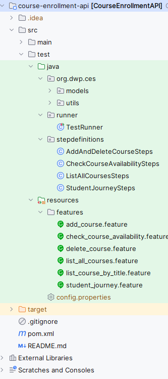

# Course Enrollment System API Automation

This project contains automated API tests for the **Course Enrollment System**.  
It is built using **Java (latest), Maven**, and **RestAssured** for API testing.

---

## 🛠 Technology Stack

- **Java:** 26
- **Maven:** Build and dependency management
- **RestAssured:** API testing framework
- **TestNG:** Test framework for assertions and test execution
- **Lombok:** Reduce boilerplate for POJOs

---

## 📁 Project Structure

---

## ⚙️ Setup Instructions
1. **Clone the repository**
```bash
git clone https://github.com/vijayakumaryalla/course-enrollment-api.git
cd course-enrollment-api
```
2. **Install Latest Java**
3. **Configure maven build tool**

## 📝 Sample Test Flow
### Student Journey End-to-End Flow
1. Login as student → get auth token
2. List courses by title, instructor, and course code
3. Check the availability
4. Enroll to a course
5. Drop from a course


## ▶️ Running Tests

### In local with 'config.properties'
#### 🔧 Configuration
Create the config.properties under src/test/resources
```bash
# Student credentials
student.username=studewsqant01
student.password=passwor$terbd123

# Instructor credentials
instructor.username=instrerductor01
instructor.password=passwoS$%vsdfgrd123
```
1. **Clean the project with Maven**
```bash
mvn clean
```
2. **Run tests**
```bash
mvn test
```
### In local with environment variables
⚠️ NOTE: The following commands must be executed in the same terminal session.
1. Setup environment variables on Windows
```bash
SET STUDENT_USERNAME=studewsqant01
SET STUDENT_PASSWORD=passwor$terbd123
SET INSTRUCTOR_USERNAME=instrerductor01
SET INSTRUCTOR_PASSWORD=passwoS$%vsdfgrd123
echo %STUDENT_USERNAME%
```
2. **Clean the project with Maven**
```bash
mvn clean
```
3. **Run tests**
```bash
mvn test
```